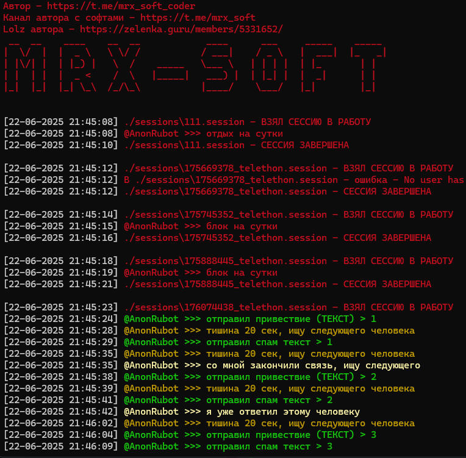

# AnonRubot_spamer
---

---
**ИНСТРУКЦИЯ ЗАПУСКА**
1. Установите Python 3.11 или НИЖЕ (https://www.python.org/downloads/)
2. Откройте cmd или PowerShell
```bash
- git clone https://github.com/MRX0011120/AnonRubot_spamer.git
- cd AnonRubot_spamer
```
3. Создайте виртуальное окружение
```bash
- python -m venv venv 
- venv\Scripts\activate
```
4. Установите зависимости (библиотеки)
```bash
- pip install --upgrade pip
- pip install -r requirements.txt
```
5. Запусти программу 
```bash
- python main.py
```
---
**ИНСТРУКЦИЯ НАСТРОЙКИ**

1. Замени данные в config.txt на свои:
```
spam_text_AnonRubot_1 = "ПЕРВОЕ СООБЩЕНИЕ"
spam_text_AnonRubot_2 = "ВТОРОЕ СООБЩЕНИЕ"
```
2. Добавь прокси SOCKS5 в proxy.txt:
```
IP:PORT@USER:PASSWORD
```
3. Добавь сессии формата telethon в папку sessions
---
КОНТАКТЫ
---
[](https://t.me/mrx_soft)[](https://t.me/mrx_soft_coder)